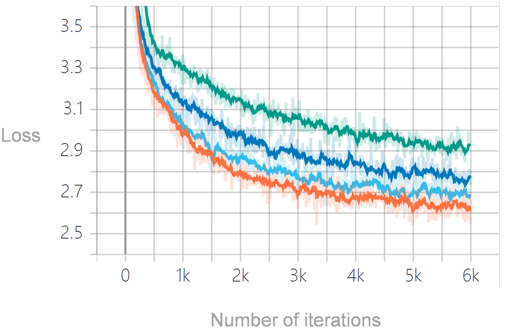
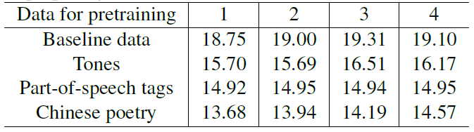

# Poetry_Music_Transformer

Analyzing music structure encoded in neural network models is a fundamental task in Music Information Retrieval (MIR). Existing work focuses on exploring the internal music structure. In this work, we propose a different approach: we analyze the music context structure embedded in neural network models based on both non-music data and music - measuring how much information a neural network model can capture when transferring from non-music data to music. Specifically, we pretrain Transformers on Classical Chinese poetry and then finetune them on Western music, finally evaluate their performance on Western music. We surprisingly find that pretraining on Classical Chinese poetry improves the testing performance on Western music, despite no overlap in surface vocabulary. To figure out what kinds of latent structure information behind Classical Chinese poetry lead to this improvement, we carry out two further experiments: one is pretraining on the level and oblique tones extracted from Classical Chinese poetry, the other is pretraining on the part-of-speech tags extracted from Classical Chinese poetry. Experiment results show that both of them contribute to the overall improvement, and the part-of-speech tags information contributes more. 

## Installation

We use a single GPU (RTX 2080 Ti) to develop this system with:
- anaconda 3 (python 3.7)
- tensorflow-gpu 2.4.1
- tensorboardX 2.1
- tf-slim 1.1.0

If you have a GPU, have installed the Display Driver, and have installed Anaconda 3, you can use the following bash code to create conda environment and install all the packages needed in this system:
```bash
conda create -n music_poetry_transformer python=3.7
source activate music_poetry_transformer
conda install tensorflow-gpu 2.4.1
pip install tf_slim 1.1.0
pip install tensorboardX 2.1
```

## Code Layout

* `pretrain.py`: Using data to pretrain the model. 
* `fintune.py`: Using data to finetune the model.
* `test.py`: Computing perplexity values to evaluate the model.
* `data_pipeline.py`: Building data class and preprocessing data.
* `GPT_Model.py`: Model used in this system.
* `config.py`: Hyperparameters setting.

## Data Preparation

- **Poetry Dataset Preparation:** The poetry dataset could be downloaded [here](https://github.com/chinese-poetry/chinese-poetry/). The original poetry dataset is in `json/`, which includes 260000 Song poems in total. Download the data and put it in `Poetry_Dataset/paragraphs/`. The level and oblique tones dataset in in `strains/json/`, which include the corresponding tones. Download the data and put it in `Poetry_Dataset/strains/`. Then run the code in `Poetry_Preprocess.ipynb` one by one. `poetry.txt`, `poetry_pos.txt`, `poetry_tone.txt` will be generated. These three files are the final files we need.

<pre>
Poetry_Dataset
├── paragraphs 
│     └── poet.song.0.json
│     └── ...
│     └── poet.song.99000.json
├── strains 
│     └── poet.song.0.json
│     └── ...
│     └── poet.song.99000.json
├── Poetry_Preprocess.ipynb
├── poetry.txt
├── poetry_pos.txt
└── poetry_tone.txt
</pre>

- **Music Dataset Preparation:** The music dataset is MAESTRO V2.0.0, which could be seen [here](https://magenta.tensorflow.org/datasets/maestro). Download `maestro-v2.0.0-midi.zip` and unzip to `./`. Then run the code `./Music_Dataset/split_train_test.ipynb`. The final music dataset is organized in the following way:

<pre>
Music_Dataset
├── train (967 MIDI files)
│     └── ...
├── test (178 MIDI files)
|     └── ...
└── split_train_test.ipynb
</pre>

Then, run the code in `Music_dataset_after_preprocess/Music_Preprocess.ipynb` one by one, the following files would be generated:

<pre>
Music_dataset_after_preprocess
├── random
│     └── 0.npz
│     └── ...
│     └── 966.npz
├── train
│     └── 0.npz
│     └── ...
│     └── 966.npz
└── test
      └── 0.npz
      └── ...
      └── 966.npz
</pre>

Now, all the datasets are prepared! You can begin to enjoy this system!

## Usage

- **Pretrain** the model on different data. A simple run would be something like:

```bash
python pretrain.py \
  -t poetry \  
  -n 1
```

In the above bash code, `-t` represents the data type of pretraining, `-t peotry` represents pretraining the model on the Classical Chinese poetry data. `-n` represents the number of experiment, `-n 1` represents the number of experiment is 1. After running the above bash code, pretrained models would be stored in `../Exp_1/poetry_pretrain/`. All the possible options about `-t` and `-n` can be seen in the following python code:

```python
parser.add_argument("-t", "--type", choices = ['random_poetry', 'poetry', 'poetry_pos', 'poetry_tone', 'random_music', 'music'])
parser.add_argument("-n", "--exp_number", choices = ['0', '1', '2', '3', '4'])
```
Please be attention that we do not set a specific iteration number, you should stop the program by yourself.

- **Finetune** the model on Western music data. A simple run would be something like:

```bash
python fintune.py \
  -t poetry \  
  -n 1
```

Similar to the pretraining process, `-t` represents finetune on which pretrained model.  `-t peotry` represents finetune the model after pretraining on the Classical Chinese poetry data. `-n 1` represents the number of the experiment is 1. After running the above bash code, the final models would be stored in `../Exp_1/poetry_fintune/`. All the possible options are the same as the pretraining process.

- **Test** the model on Western music data to compute the perplexity value. A simple run would be something like:

```bash
python test.py \
  -t poetry \  
  -n 1
```

The above bash data is used to compute the perplexity value after pretraining on the Classical Chinese poetry data, finetuning on the Western music, while the experiment number is 1. All the possible options are the same as the pretraining process.

- (Optional) You can also use tensorboard to check the training. A simple run would be something like:
```bash
cd Exp_1
tensorboard --logdir ./
```

## Results

The loss curves of an experiment could be seen in the following (Green represents the baseline data, navy represents the tones data, light blue represents the pos data, and orange represents the original poetry data):



The perplexity values of the four experiments could be seen in the following:

